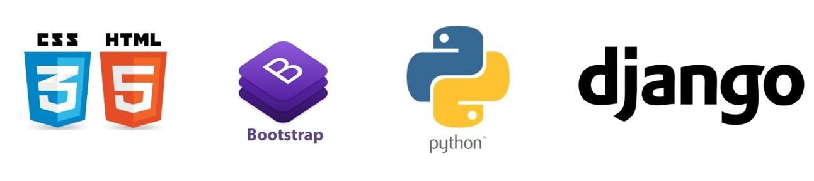

# 멋쟁이사자처럼 코딩세션 [Python]

## Python-Basic

### 🏷️ 20.05.28 Python 첫번째 세션

[0. 강의개요](python-basic-00.md)  

[1. 변수와 상수](python-basic-01.md) 

[2. 입력과 출력](python-basic-02.md)   

### 🏷️ 20.06.04 Python 두번째 세션

[3. 자료형(1)](python-basic-03(1).md)   

[4. 자료형(2)-1](python-basic-03(2).md)   

### 🏷️ 20.06.08 Python 세번째 세션

[5. 자료형(2)-2 : 리스트 & 딕셔너리](python-basic-03(2).md)    

[6. 자료형(3) : 튜플](python-basic-03(3).md)   

-  [Sample Code](https://github.com/hufslion8th/Python-Basic/blob/master/SampleCode/03.python-basic-ex5.py)  

[7. 제어문(1) : 조건문](python-basic-04(1).md)   

- [Sample Code1](https://github.com/hufslion8th/Python-Basic/blob/master/SampleCode/04.if-else-ex1.py)
- [Sample Code2](https://github.com/hufslion8th/Python-Basic/blob/master/SampleCode/04.if-else-ex2.py)  
- [Sample Code3](https://github.com/hufslion8th/Python-Basic/blob/master/SampleCode/04.if-else-ex2.py)   

[8. 제어문(2) : 반복문](python-basic-04(2).md)   

- [Sample Code1](https://github.com/hufslion8th/Python-Basic/blob/master/SampleCode/04.for-while-ex1.py)
- [Sample Code2](https://github.com/hufslion8th/Python-Basic/blob/master/SampleCode/04.for-while-ex2.py)  

[9. 함수](python-basic-05.md)   
- [Sample Code1](https://github.com/hufslion8th/Python-Basic/blob/master/SampleCode/05.function.py)
  
---

### 🔥 과제

#### Assignment1
[Python 문법 익히기 - 20.06.05(금) 23:59까지](Assignment1/Assignment1.md)  

#### Assignment2
[로또 번호 생성하기 - 20.06.14(일) 23:59까지](Assignment2/Assignment2.md)  
