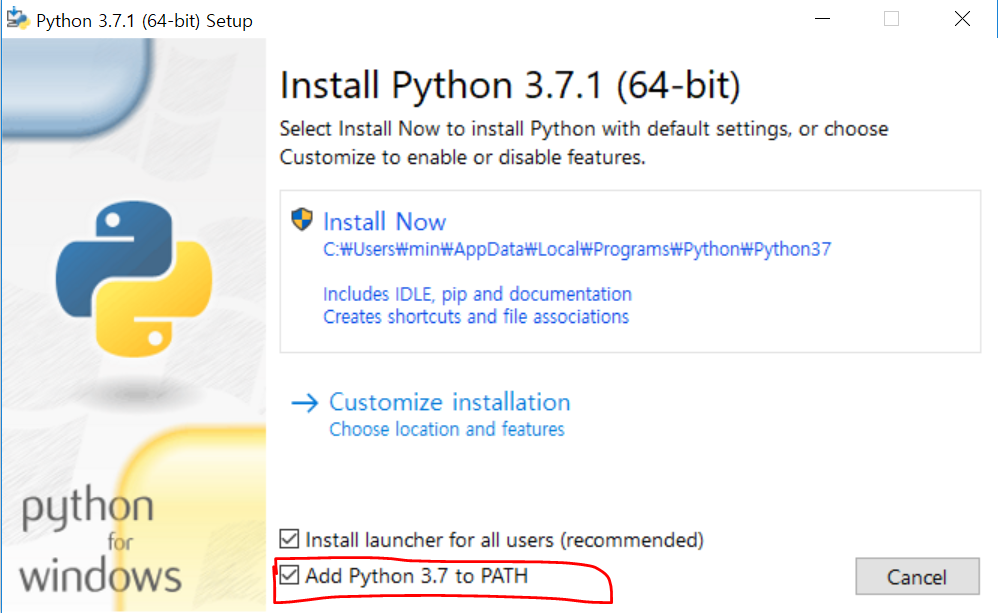

# 강의 개요

안녕하세요! 멋쟁이사자처럼 운영진 박영준입니다.

html과 마찬가지로 강의 개요를 먼저 설명할게요!

## 누구를 위한 강의인가?

> 프로그래밍을 한번도 접한적이 없는 사람!!

단순히 파이썬 문법만을 전달하는 강의가 아니라 컴퓨터와 어떤 방식으로 커뮤니케이션을 하는지 알아보는 강의 입니다.

## 당부의 말

1. 부담을 갖지 않았으면 좋겠습니다.
2. 한번에 모든 걸 끝내려 하지 않았으면 좋겠습니다.
3. 프로그래밍의 재미를 알아갔으면 좋겠습니다.

> 얕게, 여러번 반복, 직접 손으로 쳐가며!

## 준비사항

1️⃣ VS Code 설치

    [Visual Studio Code - Code Editing. Redefined](https://code.visualstudio.com/)

2️⃣ python 설치

    [Welcome to Python.org](https://www.python.org/)

    python 3.x 으로 시작하는 버전을 설치하면 됩니다. 자신의 운영체제에 맞는 걸 설치해야합니다.

## python 설치방법

1. 자신의 운영체제 버전에 맞는 python을 다운받아 설치합니다.
2. (중요) Add Python 3.7 to PATH를 체크하고 설치합니다.

    

    # Python 참고자료

    python을 공부하는데 읽어보면 재미있는 자료들입니다.

    ## python3 vs python2

    파이썬을 조금 공부해보셨으면 python 버전에 대한 이야기를 들어보셨을텐데 python2는 이제 없다고 생각하셔도 괜찮습니다. 우리는 무조껀 python3입니다.

    [https://pythonclock.org/](https://pythonclock.org/)

    ## Python 패키지들

    [Python 3 Readiness - Python 3 support table for most popular Python packages](http://py3readiness.org/)

    많이 활용되는 파이썬 패키지들 리스트입니다.

    ## Python Document

    [3.8.3 Documentation](https://docs.python.org/3/)

    ## Python 연습

    [The world's leading online coding platform](https://repl.it/)