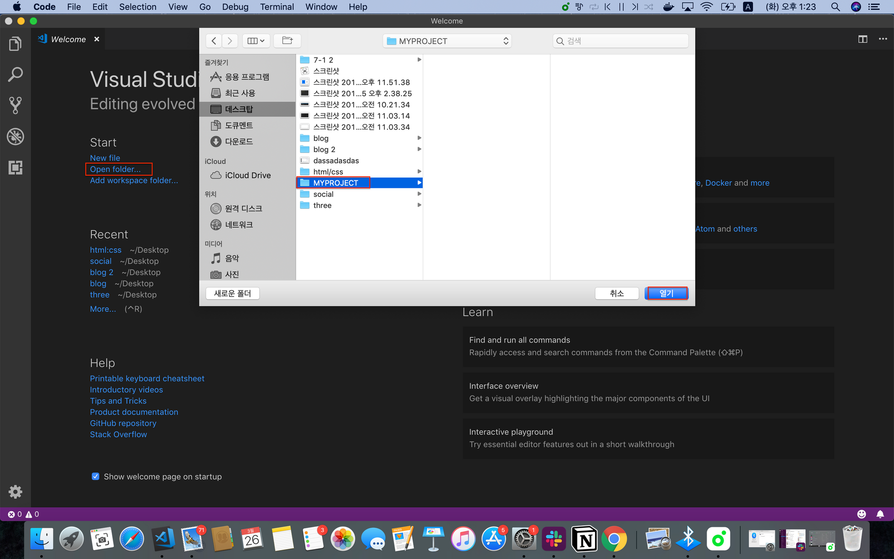
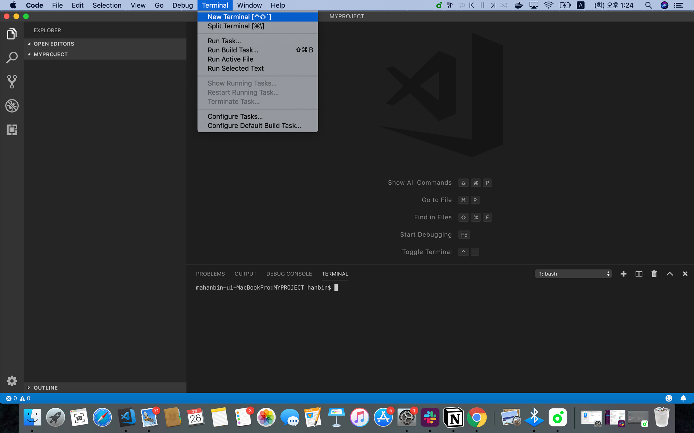
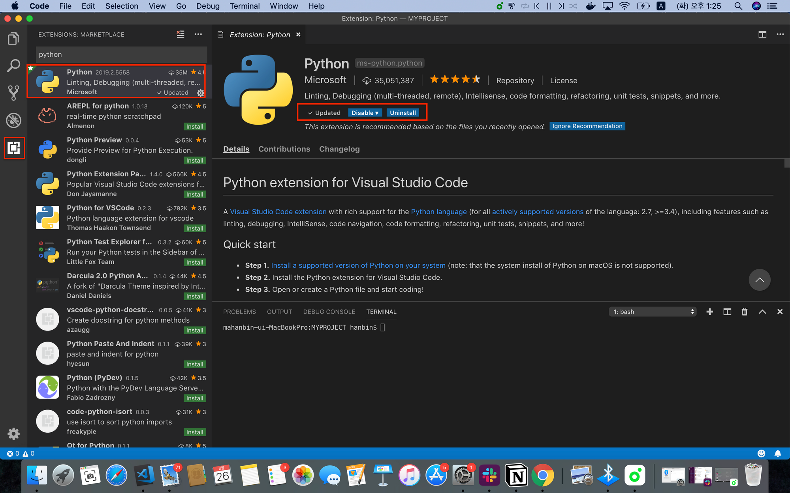
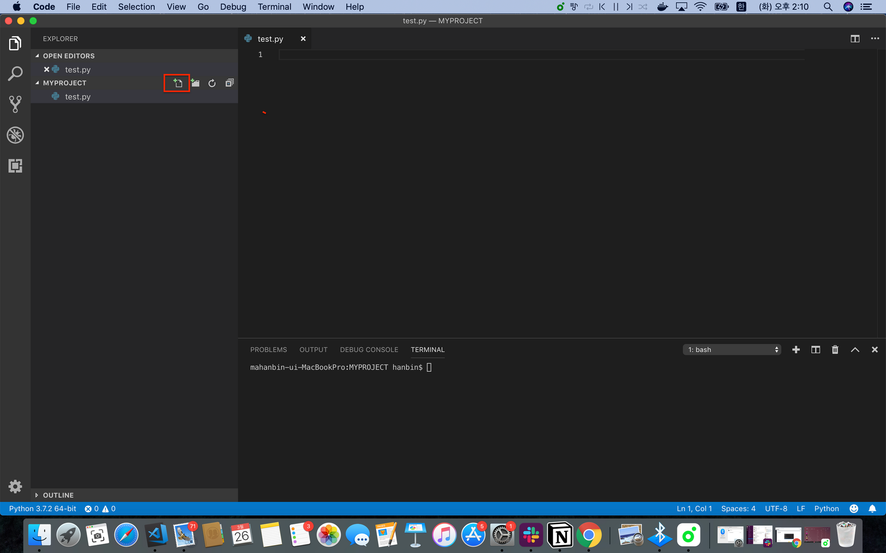

# 02. 입력과 출력
실습에 앞서 바탕화면에 `MYPROJECT` 라는 폴더를 만들어 줍시다.



VS Code를 실행하고 메인 페이지의 Open folder를 클릭한 뒤 아까 만든 폴더를 선택, 열기를 클릭합니다.



왼쪽 탭을 보면 우리가 선택한 폴더 기준으로 프로젝트가 열린 것을 볼 수 있습니다. 만약 아래쪽에 터미널이 켜져있지 않다면 터미널 탭을 클릭해 New Terminal을 생성 해줍시다.



여기까지 완료했다면, 왼쪽 가장 아랫쪽에 있는 아이콘을 클릭, python을 검색하고 설치해줍니다. vscode에서 파이썬을 사용할 수 있는 환경을 만들어주는 과정입니다.



다시 왼쪽 탭 가장 위쪽에 있는 아이콘을 클릭해 새로운 파이썬 파일을 만들어주세요. 

이제 실습할 준비가 끝났습니다!

## print

`print` 는 콘솔에 우리가 입력한 데이터를 출력해줍니다. 직접 따라 쳐 보며 결과를 확인해봅시다.

```python
print("멋쟁이 사자처럼")
print(1+2)
```

- Q. 여기서 입력된 값들은 상수일까요? 변수일까요?

```python
bee = "꾸러기 표정을 지었나요?"
print("1일 1깡 : ", bee)

bee = "화려한 조명이 감쌌나요?"
print("1일 1깡 : ", bee)
```

`bee`라는 변수를 만들어 문자열을 집어넣습니다.  
 그리고 바로 다음 줄에서 print를 이용해 `bee`를 가져와 사용합니다.   
 
 직접 코드를 작성해서 결과값을 확인해보세요!

변수에 직접 데이터를 넣어볼까요?

```python
bee = input()
print("1일 1깡 : ", bee)
```

`input()`은 사용자에게 데이터를 직접 입력받게 해줍니다. 터미널에서 직접 실행해보세요.

```python
number1 = input("첫번째 숫자를 입력하세요 : ")
number2 = input("두번째 숫자를 입력하세요 : ")

print(number1 + number2)
```

결과값이 잘 나오나요? 두개의 숫자가 더해지길 바랬는데, 나란히 붙여서 출력될겁니다. 왜 이런일이 벌어질까요?

## 문자와 숫자

컴퓨터가 데이터를 구분하는 방식은 크게 문자와 숫자로 나뉩니다. 

이런걸 `데이터 타입(자료형)`이라고 부르는데 그냥 컴퓨터가 들어오는 데이터를 문자로 생각하는 경우와 숫자로 생각하는 경우 두가지로 나뉜다고 보시면 됩니다.(사실 더 복잡하게 인식하는데 몰라도 되니 자세한 설명은 생략합니다.) 

덧셈뺄셈 같은 사칙연산을 하려면 숫자를 가지고 진행해야하는데, 위의 예제에서 우리는 '숫자'라고 적었지만 컴퓨터가 '문자'로 인식했기 때문에 우리가 원하는 숫자의 합을 얻을 수 없었던 겁니다.

```python
number1 = int(input("첫번째 숫자를 입력하세요 : "))
number2 = int(input("두번째 숫자를 입력하세요 : "))

print(number1 + number2)
```

그래서 input으로 받은 데이터를 컴퓨터에게 '야 이거 숫자야'라고 알려주는 단계가 필요해집니다. 

이때 사용하는 게 int()입니다. 직접 실행해보세요.

## 더 알아보기

```python
import math 
#누군가 작성해놓은 math라는 코드를 사용할수 있게 만들어주는 역할을 합니다.
 
math.ceil(1.5) #요렇게 하면 올림을 할 수 있죠.

```

나중에 배우겠지만 `import`는 다른 사람이 만들어 놓은 파이썬 코드들을 사용할 수 있게 불러오는 명령어입니다. 

`math`에 대한 설명은 아래링크를 참조해주세요. 

이런걸 **패키지** 혹은 **모듈** 이라고 부르며 각 패키지 마다 사용설명서같은 것들이 있으니 그때그때 검색해서 활용하면 됩니다.


[math - Mathematical functions - Python 3.7.1 documentation](https://docs.python.org/3/library/math.html)