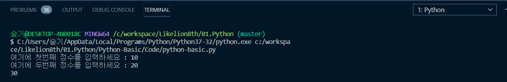
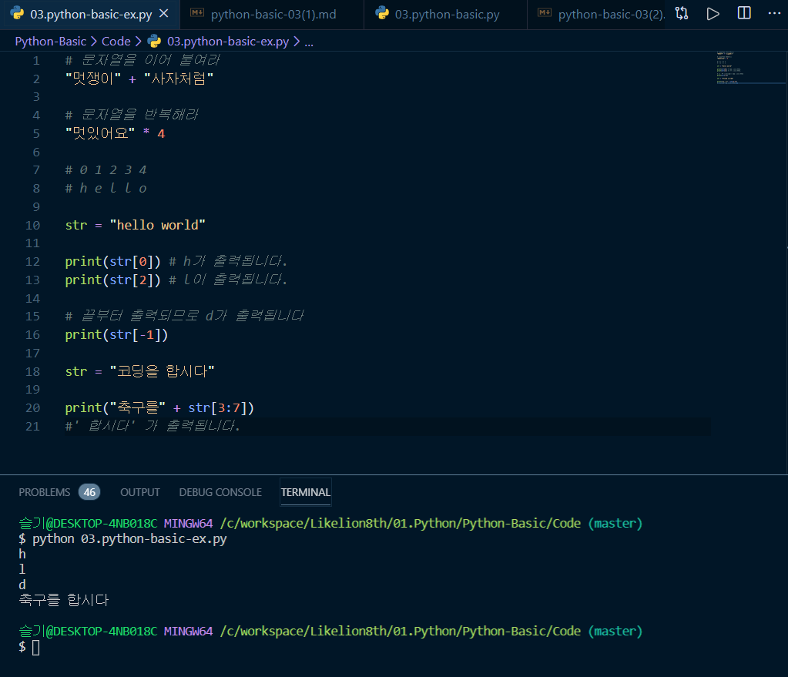
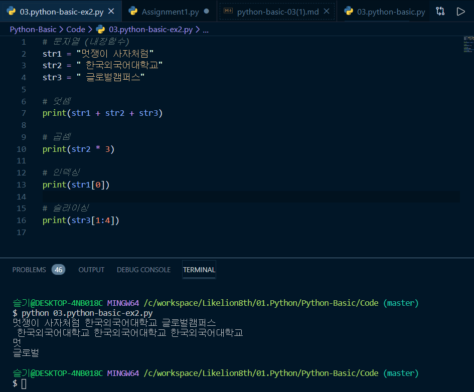

# [Python] BASIC 3. 자료형(1)

# 자료형이란?

> 자료형(Data Type) : 자료의 형태, 데이터의 종류

거창해 보이지만 데이터가 숫자인지 문자인지 구분하는 겁니다. 컴퓨터는 유능하지만 무능한 친구이기도 해서 이게 숫자인지 문자인지 구분을 못하기 때문에, 우리가 명령을 내릴때 그 구분을 해주는 겁니다.

# 파이썬의 자료형

- 숫자형
- 문자형
- 불
- 리스트
- 딕셔너리
- 튜플
- 집합

이 있습니다. 

---

## 주석

주석은 사람 눈에는 보이지만 컴퓨터 눈에는 안보이는 내용입니다. 사람한테는 보여주고 싶지만 컴퓨터가 읽지 않았으면 하는 부분에 사용합니다. 그래서 주석처리한 부분은 실행되지 않습니다. 내가 짠 코드에 대한 설명을 적어두거나, 일부 코드를 실행시키고 싶지 않을때 사용합니다.

```python
# 파이썬에서는 맨 앞에 샵을 달아 주석을 표시합니다. 
```

하지만 여러분이 직접 #을 입력할 일은 별로 없을 겁니다.

 `ctrl` + `/` 라는 단축키가 있거든요. 주석처리하고 싶은 줄에 커서를 두거나, 블록지정을 한 후 단축키를 누르면 주석이 됩니다. (대부분의 코드에디터에서 지원해주는 단축키입니다.) 명령에서 제외 시킨다는 뜻으로 'command out' 이라고 얘기 합니다.

주석처리한 내용을 해제하고 싶다면 해당 부분을 선택한 후 `ctrl` + `/` 을 다시 누르면 됩니다.

---

## 데이터타입: 숫자형

숫자형 데이터 타입은 정수형과 실수형으로 나누어집니다. 

- 정수형 : `int`
- 실수형 : `float`

int? float? 처음 만나 난감합니다. 하지만 정수형 데이터를 사용하고 싶을 때 int라는 단어를 사용하고, 실수형 데이터를 사용하고 싶을 때 float라는 단어를 사용한다고 생각하면 됩니다.

```python
num1 = int(input("여기에 첫번째 정수를 입력하세요 : "))
num2 = int(input("여기에 두번째 정수를 입력하세요 : "))

print(num1+num2)
```

`input` 을 통해 들어오는 데이터들이 기본적으로 문자로 처리된다는 것을 배운적이 있습니다. 문자형 데이터들을 숫자로 변경해 덧셈을 수행 해봅시다.

파이썬 파일을 새로 생성해 위를 복붙하고 `python 파일명.py` 명령어를 터미널에 입력해 실행해봅시다.



문자형 데이터가 숫자로 바뀌어 덧셈결과가 잘 출력되고 있습니다.

숫자형 데이터는 보통 계산이 필요할 때 사용되니 이번에는 사칙연산에 대해 알아봅시다.

계산을 할때 쓰는 기호를 연산자라고 하고, 파이썬의 연산자는 다음과 같은 것들이 있습니다.

숫자형 데이터타입의 연산자 : `+`, `-`, `*`, `/`, `//`, `%`, `**`

하나하나 살펴보면 아래와 같습니다. 막상 해보면 어렵지 않습니다.

```python
# 덧셈 : +
10 + 12

# 뺄셈 : -
14 - 12

# 곱셈 : *
9 * 7

# 나눗셈 : /, //, %
15 / 4
15 // 4
15 % 4

# 거듭제곱 : **
2**4
```

나눗셈은 연산자가 3개나 됩니다. 

- `/`는 계산기처럼 나누어버리는 연산자
- `//`는 몫만 구하는 연산자
- `%`는 나머지를 구하는 연산자

> **참고**  
> 정수  : 12, - 12, 0  
> 실수 : 10.26, - 5.3  
> 8진수 : 0o34, 0o255  
> 10진수 : `default`  
> 16진수 : 0x2A, 0xFF


## 데이터타입: 문자형

 한 글자로 이루어진 문자와 여러 글자로 이루어진 문자열을 묶어 문자형 자료형이라고 말합니다. 숫자형과 달리 문자형은 가공해서 사용하는 일이 잦기 때문에 문자형을 다루는 방법에 대해 아는 것이 중요합니다. 

먼저 문자형 데이터를 받기위해서는 `""`나 `''`로 묶어줘야합니다. 

**문자형데이터 타입의 연산자:** `+`, `*`

```python
# 문자열을 이어 붙여라
"멋쟁이" + "사자처럼"

# 문자열을 반복해라
"멋있어요" * 4 
```

문자열을 나란히 이어붙인 것 처럼 출력됩니다.

**문자와 문자열, 그리고 인덱스**

문자는 문자 하나하나를 의미하고, 문자열은 문자가 여러개 나열된 것을 말합니다. 그러면 이 문자열을 능수능란하게 접근하려면, 혹은 문자열의 관리를 좀 더 편리하게 하고 싶다면 어떻게 해야할까요? 이럴 때 사용할 수 있는 문자열 고유의 번호가 있습니다.

인덱스는 문자열에서 **각 문자 하나하나에 메겨진 숫자번호**를 의미합니다. (컴퓨터는 전통적으로 맨첫번째 인덱스를 0부터 시작합니다.)

인덱싱은 문자열에서 인덱스를 통해 문자를 호출하는 것을 말합니다.

```python
# 0 1 2 3 4
# h e l l o

str = "hello world"

print(str[0]) # h가 출력됩니다. 
print(str[2]) # l이 출력됩니다.

# 끝부터 출력되므로 d가 출력됩니다
print(str[-1]) 
```

**슬라이싱**

문자열의 인덱스를 이용하여 문자열의 일부를 뽑아내는 방법입니다. 

`[a:b]` 이런 방식으로 잘라낼 문자열을 선택하며, a 인덱스부터 b인덱스 바로 앞까지를 의미합니다.

```python
str = "코딩을 합시다"

print("축구를" + str[3:7])
#' 합시다' 가 출력됩니다.
```

파이썬 파일을 하나 만들고, 지금까지 배운 내용들을 실습해봅시다.



직접 해 보는 것이 중요합니다.

## 문자열과 관련된 내장함수

 내장함수란 말 그대로 파이썬 내부에 내장되어 있는 함수입니다. 즉, 우리가 지금까지 배운 문자열들을 편하게 다룰 수 있도록 파이썬측에서 먼저 미리 만들어 둔 함수라고 할 수 있습니다. 내장 함수들은 많고 다양하지만 그 중 자주 쓰이는 함수들 알아보겠습니다.



- len(문자열 변수) : 문자열의 길이를 측정하기 위한 내장함수입니다.
- 문자열 변수.count(특정문자) : 문자열 변수 속에 특정문자의 등장 횟수를 나타냅니다.
- 문자열 변수.split(특정문자) : 문자열 변수를 특정문자 기준으로 나눕니다.
- 문자열 변수.find(특정문자) : 문자열 변수에서 특정 문자의 인덱스를 구합니다.
- 문자열 변수.index(특정문자) : 문자열 변수에서 특정 문자의 인덱스를 구합니다.
- find와 index, 뭐가 다른가요?

    find는 문자열 변수 속에 찾고자 하는 문자가 존재하지 않을 때 **-1을 반환**합니다.

    index는 문자열 변수 속에 찾고자 하는 문자 존재하지 않을 때 **오류를 발생**시킵니다.