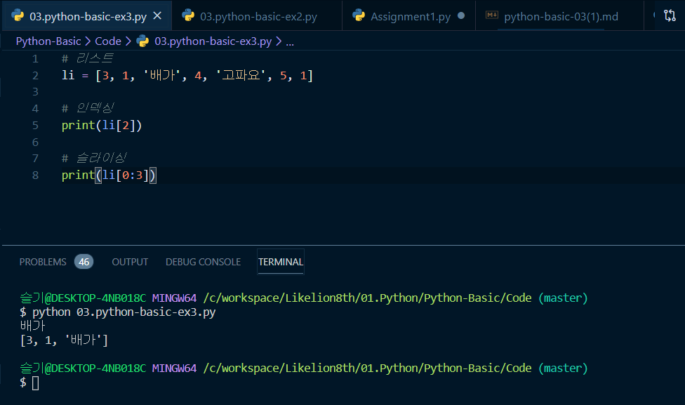
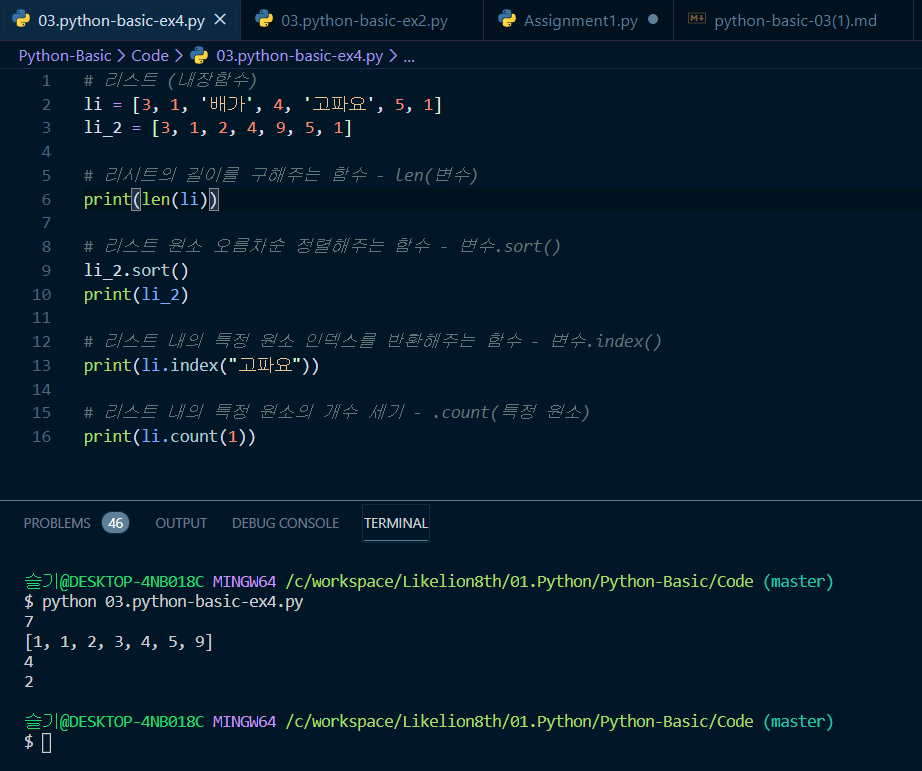
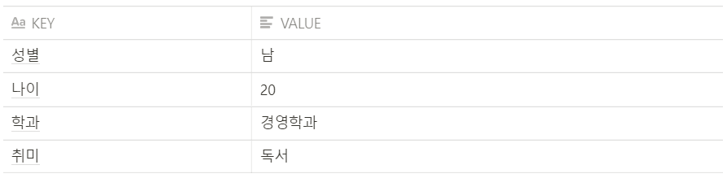
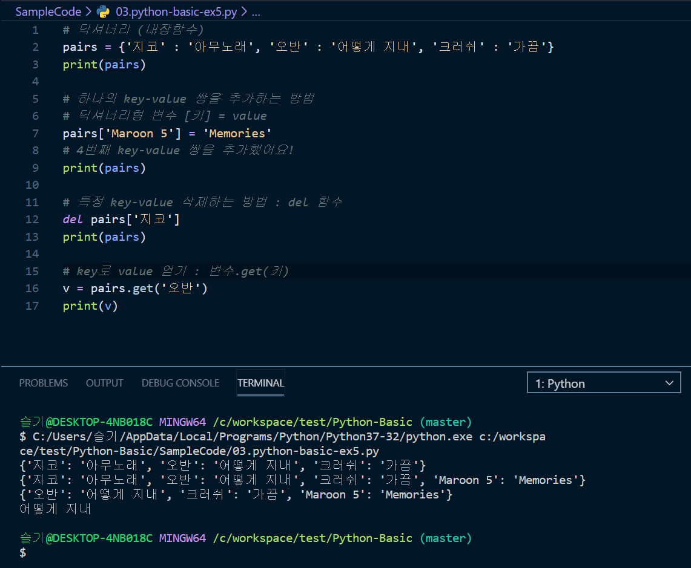

# [Python] BASIC 3. 자료형(2)

우리는 파이썬의 가장 기본적인 자료형인 숫자형과 문자형에 대해 알아보았습니다. 이어 우리가 자료를 효율적으로 관리하기 위해 필요한 자료형에 대해 알아보겠습니다. 이번에 소개할 자료형들을 잘 이해하기 위해서라면 왜 이런 자료형이 등장했고, 어떤 방법으로 데이터들을 관리할 수 있는지 정확하게 알고 넘어가는 것이 중요합니다.

## 리스트

 리스트는 **변할 수도 있는 데이터들을 나란히 묶어주는 자료형**입니다. 정리가 되어 있지않고 난잡하게 흩어져 있는 데이터들을 기준에 따라 묶어준다고 생각하면 쉽습니다. 그리고 그 데이터들은 변할 수 있죠.  

**나란히**라는 단어에서 문자열과 리스트는 비슷한 면이 있습니다. 문자들이 나란히 연결되어 있는 문자열처럼 데이터가 나란히 나열되어 있는 자료형을 리스트라고 부릅니다. 문자열과 흡사하기 때문에 덧셈, 곱셈, 인덱싱, 슬라이싱 모두 가능합니다.  

리스트는 대괄호안에 데이터를 나열하는 형태로,  **['90', '86', '98']** 같은 형태로 작성합니다. 

- 리스트 사용법
    - 리스트의 덧셈 : [1,2,3] + [4,5,6] = **[1,2,3,4,5,6]**
    - 리스트의 곱셈 : [1,2,3] * 3 == **[1,2,3,1,2,3,1,2,3]**
    - 리스트의 인덱싱 : list가 [1,2,3]인 경우 ⇒  **list[0] == 1**
    - 리스트의 슬라이싱 : list가 [1,2,3]인 경우 ⇒  **list[0:2] == [1,2]**
    - 요소 변경 : list가 [1,2,3] 인 경우 list[0]=5 ⇒ **[5,2,3]**

실습을 할 파이썬 파일을 하나 만들고 직접 작성해 실행해봅시다.

인덱싱 : list의 2번째 인덱스인 문자열 '배가' 가 출력됩니다.

슬라이싱 : list의 0번째 ~ 2번째 요소까지 리스트 형태로 출력됩니다.

## 리스트의 내장함수

 파이썬에는 리스트를 보다 편리하게 가공하고 이용할 수 있게 제공해주는 내장함수가 존재합니다.  
 
가장 많이 쓰이는 내장함수들을 알아보겠습니다.

 **len(리스트)** : 리스트의 길이를 구하는 함수입니다.

  **리스트.sort()** : 리스트의 원소를 오름차순으로 정렬해주는 함수입니다.

    sort()는 정렬된 리스트를 반환하지 않고 리스트 자체를 정렬하기 때문에 None이 출력되는 것을 볼 수 있습니다. 정렬된 리스트를 출력하고 싶다면 sort 함수를 사용한 뒤 list를 출력 해봅시다.

 **리스트.index(특정원소)** : 리스트 내에서 특정 원소값의 인덱스를 반환하는 함수입니다.

 **리스트.count(특정원소)** : 리스트 내 특정 원소의 갯수를 반환하는 함수입니다.

## 딕셔너리

 파이썬의 자료형 중 아주 중요한 부분을 차지하고 있는 것이 이 딕셔너리 자료형입니다. 
 
 딕셔너리 자료형은 **대응이 되는 데이터를 표현할 때 사용**합니다.
 
  우리가 apple이라는 단어를 사전에서 찾는 상황이라고 생각해봅시다. 
  
  apple을 찾기 위해 우리는 사전의 `a` 파트를 펼쳐야 합니다. 
  
  그래야 a로 시작하는 단어들 중 apple을 찾을 수 있을테니까요. 
  
  여기서 사전의 'a' 파트가 바로 **탐색의 기준**, 즉 `KEY` 가 되고 'apple'이 **찾고자 하는 값**, `VALUE` 가 됩니다. 
  
  예를 하나 더 들어 보겠습니다.

- 왜 이름이 딕셔너리에요?

     우리가 사전을 이용해 원하는 단어를 찾을 때, A라는 탐색의 기준을 통해 원하는 값에 접근 할 수 있습니다. 딕셔너리 자료형을 사용하는 방식이 사전에서 단어를 찾는 것과 비슷해 명명되었습니다.

위의 표는 김철수라는 사람에 대한 사전입니다. 

김철수는 다양한 특징을 갖고 있습니다. 김철수의 학과가 궁금하다면 사전에서 학과 페이지를 펼쳐 확인해보면 됩니다.

 김철수의 나이가 궁금하다면 나이 페이지를 펼쳐 확인하면 되겠죠. 

- 성별 - 남
- 나이 - 20
- 학과 - 경영학과
- 취미 - 독서

이렇게 `key` 와 `value` 가 대응합니다. 이해가 되시나요?

 딕셔너리 자료형은 중괄호 안에 `key : value` 를 나열하는 형태로, `{성별:남, 나이:20, 학과:경영학과}` 같이 작성합니다. 
 
key는 중복될 수 없고, 변형될 수도 없습니다. 

각 key마다 하나의 value를 갖고있는 **1:1 대응관계**이기 때문입니다. 

철수의 성별을 알고싶어 사전을 펼쳤는데 성별 페이지가 2장 있고, 한 페이지엔 '남' 한 페이지엔 '여' 라고 적혀있으면 어떤 게 진짜 철수의 성별인지 알 수 없기 때문입니다.

- 딕셔너리 사용법

    김철수 = {"성별":"남","나이":"20","학과":"경영학과"}

    - 김철수["성별"] == "남"

--- 

## 딕셔너리의 내장함수

 딕셔너리 자료형이 어떤 것인지 알았으니, 이제 딕셔너리의 내장함수에 대해 알아보겠습니다. 
 
 딕셔너리 자료형은 `key-value` 쌍으로 이루어져 있고 내장함수도 이와 관련된 것들이 많다고 생각하면 쉽습니다.

 **딕셔너리변수[key] = value**
 
 > 하나의 key-value 쌍을 추가합니다.

**del 딕셔너리변수[key]**

> 특정 key-value쌍을 삭제하는 방법입니다. key는 유일한 값이기 때문에 이를 기준으로 요소를 삭제합니다.

    del 함수는 딕셔너리 자료형 뿐만 아니라 리스트,튜플에서도 요소를 삭제하는 데 사용되니 기억해두면 좋습니다.

 **딕셔너리변수.get(key)**
 
 > key를 이용해 value를 얻는 내장함수입니다.