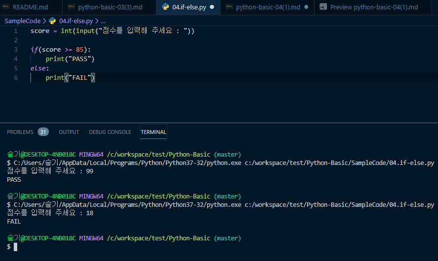
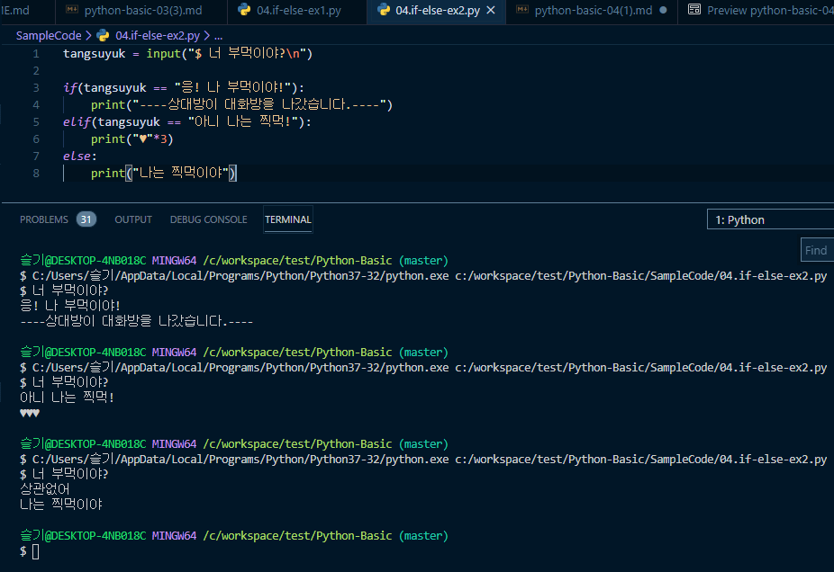
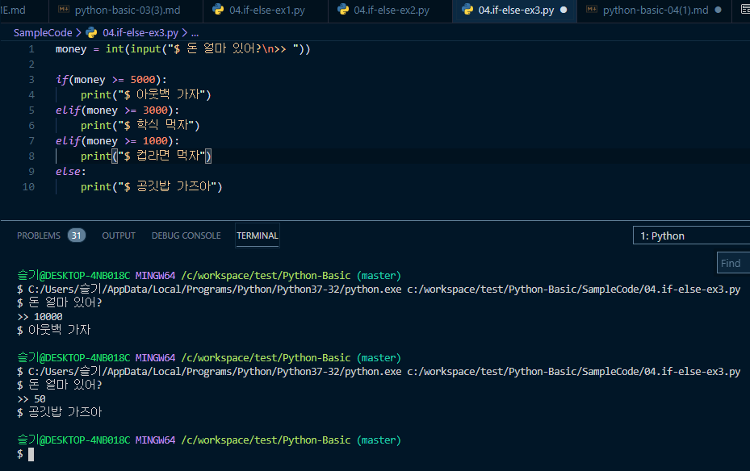

# [Python] BASIC 4. 제어문(1)

# 제어문

 제어문이란 무엇일까요? 
 
 제어문은 현재 **상황에 따라 실행을 달리할 수 있게끔 도와주는 문법**들을 말합니다.  
 
 위에서부터 아래로 내려오며 차례차례 실행했던 지금까지와 달리, 프로그램의 흐름을 가로채 다른 동작을 할 수 있도록 도와주는 일을 합니다. 
 
 이러한 제어문에는 조건문(분기문)과 반복문이 있습니다. 

오늘은 제어문, 그 중 **분기문**에 대해 먼저 알아봅시다.

--- 

## 조건문

  분기문은 조건에 따라 다른 동작을 하게끔 만드는 문법입니다. 
  
  만약 ~하다면 이 코드를 실행해라! 하는 뜻이라 **if문**이라고도 불립니다. 
  
  if문은 컴퓨터에게 **선택의 여지와 조건을 부여하는 문법**입니다. 
  
  예를 들어, 가지고 있는 돈에 따라 다른 점심 메뉴를 출력하는 프로그램을 작성한다고 생각해 봅시다.

```python
만약 돈이 5000원 이상이면?
 ======> 아웃백
만약 3000원이상 5000원 미만이면
 ======> 학식
만약 1000원 이상 3000원 미만이면
 ======> 컵라면
만약 1000원 미만이면
 ======> 공깃밥
```

가지고 있는 조건에 따라 다른 결과를 출력해야 합니다. 이를 분기문으로 작성하면 이렇게 됩니다.

```python
if(돈이 5000원 이상이라면):
	print(아웃백)
elif(돈이 3000원이상 5000원 미만이면):
	print(학식)
elif(돈이 1000원이상 3000원 미만이면):
	print(컵라면)
else:
	print(공깃밥)
```

`if` 를 사용하여 조건에 따라 다른 결과를 출력하도록 합니다. 

조건이 여러 개라면 `elif` 를 사용해 나타내줍니다. `if` 와 `elif` 어느 조건에도 해당하지 않을 때 실행하고 싶은 구문은 `else` 뒤에 씁니다. 

모든 `:` 의 아랫줄에는 **들여쓰기**를 하고 실행할 구문을 넣어주세요.

---

## 조건문 실습

 점수를 입력하면 시험 결과를 알려주는 프로그램을 작성해봅시다.

```python
score = int(input("점수를 입력해 주세요 : "))

if(score >= 85):
    print("PASS")
else:
    print("FAIL")
```



기준점수를 85점으로 잡고, 85점 이상이면 PASS를 출력하고, 미만이면 FAIL을 출력합니다.

이번에는 탕수육이 부먹인지 찍먹인지 물어보는 프로그램을 작성해봅시다.

```python
tangsuyuk = input("너 부먹이야?\n")

if(tangsuyuk == "부먹"):
    print("----상대방이 대화방을 나갔습니다.----")
elif(tangsuyuk == "찍먹"):
    print("♥"*3)
else:
    print("나는 찍먹이야")
```



부먹을 입력하면 상대방이 대화방을 나가는 문구가 출력됩니다.


마지막으로 우리가 제일 처음 예제로 보았던 점심 추천 프로그램을 만들어봅시다.

```python
money = (int(input("돈 얼마 있어? ")))

if(money >= 5000):
    print("아웃백 가자")
elif(money >= 3000):
    print("학식 먹자")
elif(money >= 1000):
    print("컵라면 먹자")
else:
    print("공깃밥 가즈아")
```




가지고 있는 돈에 따라 점심메뉴를 다르게 출력하고 있습니다.